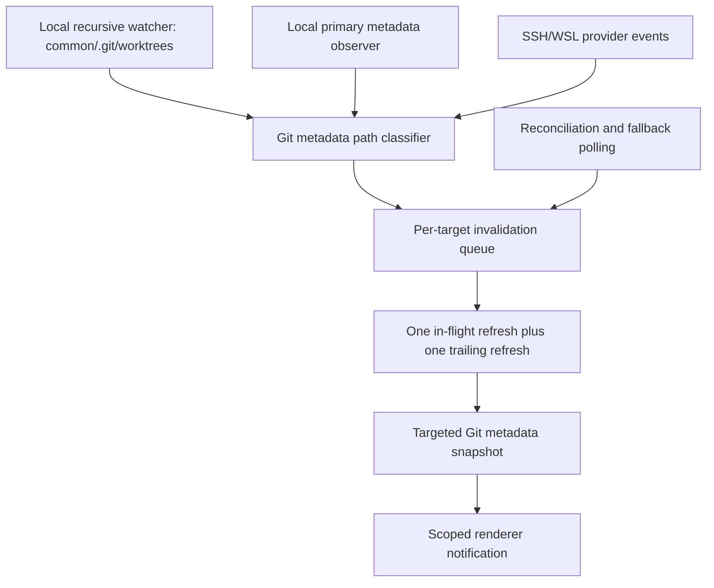

# Git Metadata Event-Driven Refresh

## Problem

Orca currently polls Git metadata targets on a short interval. A Git-common target can stat six primary metadata files, read `.git/worktrees`, and stat approximately six metadata paths per linked worktree on each poll. The cost grows with the number of linked worktrees and the number of watched repositories, even when nothing changed.

This recurring work competes with renderer updates, Git subprocesses, and IPC notifications. It contributes to input lag and delayed worktree refreshes.

## Decision summary

Use the existing native filesystem watcher dependency for narrow local Git metadata roots. Keep polling only for:

- watcher failure or overflow;
- filesystems without reliable native events;
- SSH/WSL providers without an event stream;
- periodic missed-event reconciliation.

Do not use a content-search process for Git metadata observation. Content search and filesystem observation have different requirements.

The healthy local path should be event-driven:

```text
native event -> path classification -> merged target invalidation -> targeted refresh
```

The fallback path should be bounded:

```text
watcher failure/backstop -> reconciliation queue -> bounded snapshot
```

## Existing Orca foundation

Orca already has the core pieces needed for the first implementation:

- A native watcher dependency is already a production dependency.
- Native watcher subscriptions run in a crash-isolated child process.
- Watcher event delivery has active/pending batch limits and overflow signaling.
- Darwin already has a narrow `.git/worktrees` watcher.
- Watcher failure can fall back to the existing metadata poller.
- Root deletion/recreation and hidden-window parking are already handled.
- Renderer notifications already debounce changes for 250 ms.

Relevant modules:

- `src/main/ipc/worktree-git-common-watch.ts`
- `src/main/ipc/parcel-watcher-process.ts`
- `src/main/ipc/parcel-watcher-process-entry.ts`
- `src/main/ipc/parcel-watcher-event-delivery.ts`
- `src/main/ipc/worktree-git-common-watch-reconciliation.ts`
- `src/main/ipc/worktree-git-common-polling.ts`
- `src/main/ipc/worktree-base-directory-notifications.ts`

## Native watcher capabilities

The current native dependency provides:

- recursive create/update/delete events;
- platform-native backends for macOS, Linux, and Windows;
- ignore paths and ignore globs;
- event coalescing in the native layer;
- historical event queries using saved snapshots;
- overflow/error reporting.

The current API is recursive. It does not provide a nonrecursive directory watcher through the existing subscription wrapper. That distinction matters for primary common-directory metadata: recursively watching the entire common `.git` directory would include objects and unrelated reference churn.

The upstream API does not currently expose a `recursive: false` subscription mode. Its public type surface accepts the watch root, callback, ignore options, and backend selection, but no recursion flag. A nonrecursive-mode request remains an open upstream design issue.

The candidate runtime's `node:fs.watch` implementation does provide a shallow directory watch by default and accepts an abort signal. That is useful for the primary common-directory files, but the current desktop main process runs inside Electron's Node runtime. Adopting that runtime only for one watcher would add another packaged process without improving the recursive watcher path. If the application runtime moves later, the same shallow-watch contract can be used inside the existing watcher child; it should not block this design.

## Target architecture



### Watch scopes

#### Linked worktree metadata

Watch recursively:

```text
<common-dir>/.git/worktrees
```

Classify events by path:

```text
<name>/HEAD
<name>/gitdir
<name>/locked
<name>/config.worktree
  -> structure/head-identity invalidation

<name>/index
<name>/logs/HEAD
  -> status invalidation

<name> creation/deletion
  -> worktree-list invalidation
```

This scope excludes the working tree and the common Git object database.

#### Primary checkout metadata

Observe only:

```text
HEAD
packed-refs
index
config
config.worktree
logs/HEAD
```

Preferred implementation: a nonrecursive watcher in the crash-isolated watcher child, attached to the common Git directory and filtered to these names.

Fallback implementation: retain the existing six-file stat poll.

#### Selected upstream refs

Continue observing only the selected upstream ref paths. Do not recursively watch all refs unless a consumer explicitly requires that behavior.

## Refresh coalescing

Key refresh state by execution host and repository/common-directory identity. Each target owns:

- current watcher state;
- one in-flight refresh;
- one merged trailing request;
- last successful snapshot;
- next reconciliation deadline;
- active-consumer count.

Merge invalidations by strength:

```text
worktree structure/full refresh > status refresh > ref-only refresh
```

A new event while a refresh is running must not start another concurrent refresh. It updates the trailing request instead.

Internal Orca mutations should enqueue the same semantic invalidation directly rather than waiting for the filesystem watcher to observe Orca's own write.

## Failure and recovery

A watcher failure must not silently freeze metadata.

Required behavior:

1. Mark the watcher unhealthy.
2. Preserve the last known snapshot.
3. Schedule bounded fallback reconciliation.
4. Retry native subscription with backoff.
5. Resync after reattachment.
6. Return to event-driven mode only after a successful subscription.

Root deletion is not equivalent to watcher failure. A deleted `.git/worktrees` directory should:

- emit the appropriate structural invalidation;
- release the old subscription;
- watch for directory recreation;
- reattach when the directory returns.

Overflow is a correctness signal. On overflow, discard assumptions about missed paths and run a full target reconciliation.

## Platform matrix

| Execution location | Healthy observation                                         | Fallback                                          |
| ------------------ | ----------------------------------------------------------- | ------------------------------------------------- |
| macOS local        | Existing narrow watcher plus primary observer               | Existing poller and reconciliation                |
| Linux local        | Narrow watcher after inotify/watch-count validation         | Bounded poller and reconciliation                 |
| Windows local      | Narrow watcher after active `git worktree prune` validation | Bounded poller and reconciliation                 |
| SSH                | Provider-owned remote watch when available                  | Provider-scoped fallback polling                  |
| WSL                | WSL-side observation when available                         | WSL-scoped fallback polling                       |
| Folder workspace   | Existing folder watcher behavior                            | Explicit refresh or bounded folder reconciliation |

No local watcher or local content-search process may be used as a substitute for remote filesystem observation.

## Scope split

### Watcher implementation

- Use the existing narrow watcher for macOS, Linux, and Windows.
- Pass the Windows backend explicitly to avoid backend probing noise.
- Watch the six primary metadata paths shallowly in the crash-isolated child.
- Poll only selected upstream ref paths on the healthy local path.
- Keep six-file polling for watcher failure and reconciliation.
- Keep the current structural fallback poller and reconciliation.
- Use the full poller on unsupported local platforms.
- Validate root deletion/recreation, overflow, watcher failure, and active `git worktree prune`.

The implementation contract is intentionally small:

```text
darwin/linux/win32 -> watcher child: <common>/.git/worktrees
darwin/linux/win32 -> watcher child: selected primary metadata leaves
darwin/linux/win32 -> bounded poll: selected upstream refs only
other local host   -> existing bounded metadata poller
watcher failure    -> bounded metadata poller and reconciliation
```

The watcher child remains the only owner of native subscriptions. The main
process only receives normalized events and owns fallback scheduling. No remote
wire message or renderer contract changes in this slice.

This removes recurring linked-worktree scans and primary metadata stats from the
healthy local path without introducing a new remote protocol.

### Separate refresh-admission implementation

- Measure downstream `git status`, `git for-each-ref`, and `git worktree` fanout.
- Add one-in-flight plus one-trailing refresh admission per target.
- Add foreground priority only if measurements show background Git refreshes competing with active worktree interaction.

Do not combine this with the first watcher-platform change unless the measurements require it.

## Performance expectations

For a Git-common target with `E` linked worktrees, the current recurring work is approximately:

```text
6 × E linked-worktree stats + 6 primary stats + one worktrees listing every 2 seconds
```

With a healthy narrow linked-worktree watcher:

```text
6 primary stats every 2 seconds + targeted work only after events
```

Approximate reduction in recurring local metadata operations:

| Linked worktrees | Reduction |
| ---------------: | --------: |
|                1 |      ~50% |
|                5 |      ~84% |
|               10 |      ~91% |
|               50 |      ~98% |
|              100 |      ~99% |

These are filesystem-operation reductions, not guaranteed UI-latency reductions. Git subprocess and renderer invalidation costs must be measured separately.

## Instrumentation

Add counters before changing behavior:

- watcher events received by target and platform;
- watcher overflows and failures;
- fallback poll ticks;
- full reconciliations;
- stat/readdir operations by target;
- refresh requests merged while in flight;
- Git subprocesses started per target;
- active and pending refresh counts;
- event-to-notification latency.

The key success condition for the first implementation is:

```text
healthy local watcher + idle repository -> no recurring linked-worktree snapshot scans
```

## Non-goals

- Replacing Git commands with content search.
- Recursively watching an entire working tree.
- Recursively watching the common Git object database.
- Adding a local watcher for SSH or WSL paths.
- Removing fallback polling before native watcher recovery is proven.
- Changing remote wire protocols in the first implementation.
- Optimizing Settings rendering before background metadata load is bounded.
